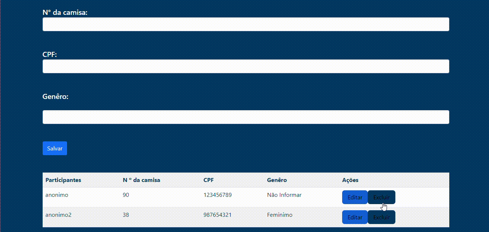

## README EM CONSTRUÇÃO     

## 🥇 Inscrições de campeonato 
Com base na experiência e conhecimento adquirido na [versão primária](https://witoriabeatriz.github.io/Cadastro-versao-primaria/) deste projeto, em busca da inovação consegui a evolução e aprimoramento do código, fazendo um esquema para solucionar problemas de inscrições para campeonatos de corrida.

## Cadastro

## Login  

## Inscrições

  

  

  

